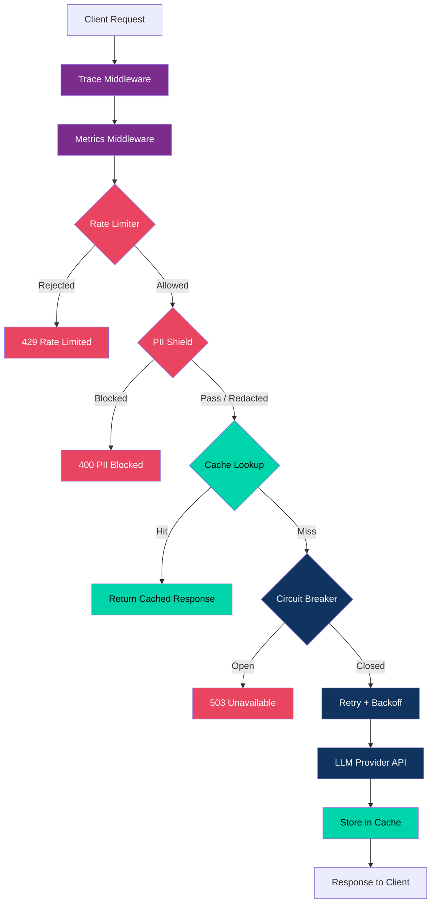

# ⚡ Sentinel

**Production-grade LLM Gateway with security, resilience, and observability.**

[](https://github.com/ArmanHov2006/sentinel/actions/workflows/ci.yml)


Sentinel sits between your application and LLM providers (OpenAI, Groq), adding security guardrails, resilience patterns, and operational visibility to every request. It exposes an OpenAI-compatible `/v1/chat/completions` endpoint so you can drop it in front of any existing integration — getting PII detection, rate limiting, circuit breakers, response caching, request tracing, and a live monitoring dashboard without changing your client code.

---

## Architecture



> **Legend:** 🟣 Observability &nbsp; 🔴 Security &nbsp; 🔵 Resilience &nbsp; 🟢 Performance

---

## Features

| Category | Feature | Description |
|----------|---------|-------------|
| 🛡️ Security | PII Detection & Redaction | Detects emails, phone numbers, names, locations, SSNs, credit cards, and IP addresses via Microsoft Presidio. Configurable `BLOCK` / `REDACT` / `WARN` actions. |
| 🛡️ Security | Rate Limiting | Redis-backed sliding window algorithm. Per-client IP throttling with configurable limits and `Retry-After` headers. |
| 🔄 Resilience | Circuit Breakers | Per-provider circuit breaker with `CLOSED` / `OPEN` / `HALF_OPEN` states. Prevents cascading failures when a provider is down. |
| 🔄 Resilience | Retry with Exponential Backoff | Configurable retry policy with jitter to handle transient provider failures gracefully. |
| ⚡ Performance | Response Caching | Cache-aside pattern with SHA-256 key generation. Redis-backed with configurable TTL. Identical requests return instantly from cache. |
| ⚡ Performance | SSE Streaming | Real-time token-by-token streaming in OpenAI's Server-Sent Events format. |
| 📊 Observability | Request Tracing | Correlation IDs via `X-Request-ID` header. Automatically generated or forwarded from upstream. Flows through the entire pipeline and into every log line. |
| 📊 Observability | Health Checks | `/health` endpoint with Redis connectivity (latency measured) and circuit breaker state checks. Returns `healthy` / `degraded` / `unhealthy`. |
| 📊 Observability | Live Metrics | `/metrics` endpoint returning request counts, response-time percentiles (p50/p95/p99), cache hit rates, and security event counters. |
| 📊 Observability | Monitoring Dashboard | Real-time web dashboard at `/dashboard` with Chart.js visualizations — response-time graphs, status-code distribution, security event bars, Redis sparkline, and circuit breaker state cards. |
| 🐳 DevOps | Docker | One-command deployment with `docker-compose`. Includes Redis with persistence and an optional Redis Commander UI. |
| 🐳 DevOps | CI/CD | GitHub Actions pipeline: Ruff lint + format check, pytest with coverage, Docker build + smoke test. |

---

## Quick Start

### Prerequisites

- Docker and Docker Compose
- An OpenAI or Groq API key

### Run

```bash
# Clone the repository
git clone https://github.com/ArmanHov2006/sentinel.git
cd sentinel

# Set your API key
export OPENAI_API_KEY=your-key-here

# Start everything
docker-compose up -d

# Verify it's running
curl http://localhost:8000/health
```

### Try It

```bash
# Send a chat request
curl -X POST http://localhost:8000/v1/chat/completions \
  -H "Content-Type: application/json" \
  -d '{
    "model": "gpt-4",
    "messages": [{"role": "user", "content": "Hello, how are you?"}]
  }'

# Check metrics
curl http://localhost:8000/metrics

# Open the dashboard
open http://localhost:8000/dashboard
```

---

## Configuration

All configuration is via environment variables. Set them in a `.env` file or pass them directly.

### Provider Settings

| Variable | Default | Description |
|----------|---------|-------------|
| `OPENAI_API_KEY` | — | OpenAI API key |
| `OPENAI_BASE_URL` | `https://api.openai.com/v1` | OpenAI-compatible API base URL |
| `GROQ_API_KEY` | — | Groq API key (takes precedence over OpenAI if set) |
| `GROQ_BASE_URL` | `https://api.groq.com/openai/v1` | Groq API base URL |

### Security Settings

| Variable | Default | Description |
|----------|---------|-------------|
| `PII_ACTION` | `REDACT` | How to handle PII: `BLOCK`, `REDACT`, or `WARN` |
| `RATE_LIMIT_MAX_REQUESTS` | `100` | Maximum requests per window per client |
| `RATE_LIMIT_WINDOW_SECONDS` | `60` | Sliding window duration in seconds |

### Redis Settings

| Variable | Default | Description |
|----------|---------|-------------|
| `REDIS_HOST` | `localhost` | Redis server hostname |
| `REDIS_PORT` | `6379` | Redis server port |
| `REDIS_SOCKET_TIMEOUT` | `5.0` | Redis socket timeout in seconds |

### Resilience Settings

| Variable | Default | Description |
|----------|---------|-------------|
| `RETRY_MAX_ATTEMPTS` | `3` | Maximum retry attempts for provider calls |
| `RETRY_BASE_DELAY` | `1.0` | Base delay in seconds for exponential backoff |
| `RETRY_MAX_DELAY` | `40.0` | Maximum delay cap in seconds |

### Application Settings

| Variable | Default | Description |
|----------|---------|-------------|
| `SENTINEL_ENV` | `development` | Environment name |
| `HOST` | `0.0.0.0` | Server bind address |
| `PORT` | `8000` | Server bind port |
| `REQUEST_TIMEOUT_SECONDS` | `60.0` | HTTP request timeout |

---

## API Reference

| Method | Endpoint | Description |
|--------|----------|-------------|
| `POST` | `/v1/chat/completions` | OpenAI-compatible chat completions with full security and resilience pipeline |
| `GET` | `/health` | System health with Redis connectivity, circuit breaker states, and uptime |
| `GET` | `/metrics` | Operational metrics: request counts, percentiles, cache stats, security events |
| `GET` | `/dashboard` | Live monitoring dashboard with real-time charts |
| `GET` | `/docs` | Interactive Swagger API documentation |

### Response Headers

Every response includes tracing and rate-limit headers:

| Header | Description |
|--------|-------------|
| `X-Request-ID` | Unique correlation ID for the request (generated or forwarded) |
| `X-Response-Time` | Server-side processing time (e.g. `12.34ms`) |
| `X-RateLimit-Limit` | Maximum requests allowed in the current window |
| `X-RateLimit-Remaining` | Requests remaining in the current window |

---

## Project Structure

```
sentinel/
├── src/sentinel/
│   ├── api/                  # FastAPI routes and schemas
│   │   ├── routes/           # Operational endpoints (health, metrics)
│   │   ├── schemas/          # Pydantic request/response models
│   │   └── v1/              # Versioned API endpoints (chat)
│   ├── core/                 # Infrastructure (config, Redis, metrics, tracing)
│   ├── domain/               # Domain models and exceptions
│   ├── middleware/            # Request tracing and metrics middleware
│   ├── providers/            # LLM provider integrations (OpenAI)
│   ├── services/             # Business logic (caching)
│   ├── shield/               # Security layer (PII detection + redaction)
│   ├── static/               # Monitoring dashboard (HTML + Chart.js)
│   └── main.py               # Application entry point
├── tests/                    # Unit and integration tests
├── .github/workflows/        # CI/CD pipeline
├── docker-compose.yml        # One-command deployment
├── Dockerfile                # Container definition
├── Makefile                  # Developer shortcuts
├── ruff.toml                 # Linter configuration
└── requirements.txt          # Python dependencies
```

---

## Development

   ```bash
make up          # Start services in background
make down        # Stop services
make build       # Rebuild containers from scratch
make logs        # Follow sentinel container logs
make test        # Run tests inside container
make lint        # Run ruff linter inside container
make dev         # Start with Redis Commander (port 8081)
make redis-cli   # Open Redis CLI
make shell       # Open bash shell in sentinel container
make status      # Show container status
make clean       # Remove everything including volumes
```

### Running Locally (without Docker)

   ```bash
   pip install -r requirements.txt
export PYTHONPATH=src
uvicorn sentinel.main:app --port 8000
```

---

## Testing

   ```bash
# Run all tests (inside Docker)
make test

# Run locally with coverage
PYTHONPATH=src pytest -v --cov=sentinel --cov-report=term-missing

# Run a specific test file
PYTHONPATH=src pytest tests/test_circuit_breaker.py -v
```

---

## Tech Stack

| Component | Technology |
|-----------|------------|
| Web Framework | FastAPI (async) |
| Data Validation | Pydantic v2 |
| PII Detection | Microsoft Presidio |
| Caching & Rate Limiting | Redis |
| HTTP Client | HTTPX (async) |
| Dashboard Charts | Chart.js |
| Containerization | Docker + Docker Compose |
| CI/CD | GitHub Actions |
| Linting | Ruff |

---

## License

MIT License. See [LICENSE](LICENSE) for details.

---

Built with a genuine interest in production systems engineering.
