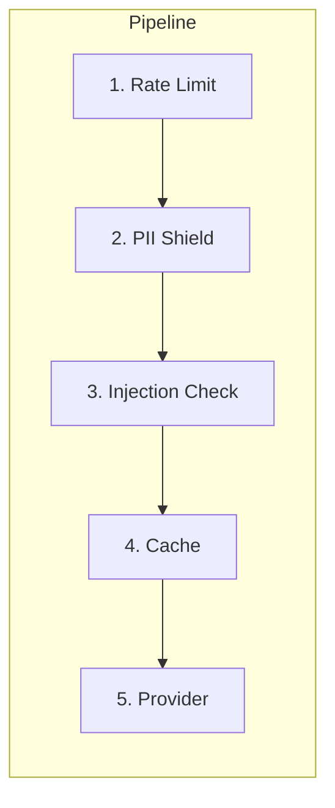

# Sentinel

**Production-grade LLM Gateway with security, resilience, and observability.**

[](https://github.com/ArmanHov2006/sentinel/actions/workflows/ci.yml)


Sentinel is a FastAPI gateway that sits between your application and LLM providers (OpenAI, Anthropic). It provides PII detection, prompt injection detection, rate limiting, circuit breakers, caching, semantic caching, LLM-as-judge evaluation, and multi-provider failover—without changing your client code.

---

## Architecture Overview

Sentinel acts as a middleware layer between clients and LLM providers. Every request flows through a 5-stage pipeline:


```mermaid
flowchart LR
    A[1. Rate Limit] --> B[2. PII Shield]
    B --> C[3. Injection Check]
    C --> D[4. Cache]
    D --> E[5. Provider]

    subgraph Pipeline
        A
        B
        C
        D
        E
    end
```

| Stage | Component | Purpose |
|-------|-----------|---------|
| 1. Rate Limit | Redis-backed sliding window | Throttle per-client requests |
| 2. PII Shield | Microsoft Presidio | Detect and redact/block PII |
| 3. Injection Check | LLM-based detector | Block prompt injection attempts |
| 4. Cache | Redis + FAISS semantic cache | Return cached responses for identical or similar requests |
| 5. Provider | OpenAI, Anthropic, failover | Route to LLM with circuit breaker and retry |

---

## Features

### Security
- **PII Detection & Redaction** — Detects emails, phone numbers, names, SSNs, credit cards via Microsoft Presidio. Configurable `BLOCK` / `REDACT` / `WARN` actions.
- **Prompt Injection Detection** — LLM-based classifier blocks malicious prompt injection attempts.
- **API Key Auth** — Virtual API keys for machine-to-machine authentication (optional).

### Performance
- **Redis Cache** — Cache-aside pattern with SHA-256 keys. Identical requests return instantly.
- **Semantic Caching** — FAISS + sentence-transformers for cosine-similarity cache hits on paraphrased requests.
- **SSE Streaming** — Real-time token-by-token streaming in OpenAI format.

### Resilience
- **Circuit Breaker** — Per-provider 3-state (CLOSED / OPEN / HALF_OPEN) circuit breaker prevents cascading failures.
- **Retry with Backoff** — Configurable exponential backoff with jitter.
- **Multi-Provider Failover** — Automatic failover between OpenAI and Anthropic when a provider is unavailable.

### Observability
- **Structured Logging** — structlog with JSON output and correlation IDs.
- **Prometheus Metrics** — Request counts, latencies, cache hit rates, security events.
- **OpenTelemetry** — Distributed tracing with OTLP export.
- **Grafana Dashboard** — Real-time monitoring with Prometheus + Grafana stack.

---

## Quick Start

### 1. Clone and start

```bash
git clone https://github.com/ArmanHov2006/sentinel.git
cd sentinel
docker-compose up -d
```

### 2. Set API keys

```bash
export OPENAI_API_KEY=your-openai-key
export ANTHROPIC_API_KEY=your-anthropic-key
```

### 3. Send a request

```bash
curl -X POST http://localhost:8000/v1/chat/completions \
  -H "Content-Type: application/json" \
  -d '{
    "model": "gpt-4",
    "messages": [{"role": "user", "content": "Hello, how are you?"}]
  }'
```

---

## Configuration

| Variable | Default | Description |
|----------|---------|-------------|
| `OPENAI_API_KEY` | — | OpenAI API key |
| `ANTHROPIC_API_KEY` | — | Anthropic API key |
| `REDIS_HOST` | `localhost` | Redis server hostname |
| `REDIS_PORT` | `6379` | Redis server port |
| `SENTINEL_ENV` | `development` | Environment (`development` / `production`) |
| `REQUIRE_AUTH` | `false` | Enable API key authentication |
| `SENTINEL_MASTER_KEY` | — | Master key for admin operations when auth enabled |
| `PII_ACTION` | `REDACT` | PII handling: `BLOCK`, `REDACT`, or `WARN` |
| `ENABLE_JUDGE` | `false` | Enable LLM-as-judge quality evaluation |
| `OTEL_ENABLED` | `true` | Enable OpenTelemetry tracing |

---

## API Reference

Interactive Swagger documentation is available at **[/docs](http://localhost:8000/docs)** when the server is running.

| Endpoint | Description |
|----------|-------------|
| `POST /v1/chat/completions` | OpenAI-compatible chat completions |
| `GET /health` | Health check (Redis, circuit breakers) |
| `GET /metrics` | Prometheus metrics |
| `GET /dashboard` | Monitoring dashboard |

---

## License

MIT License. See [LICENSE](LICENSE) for details.
