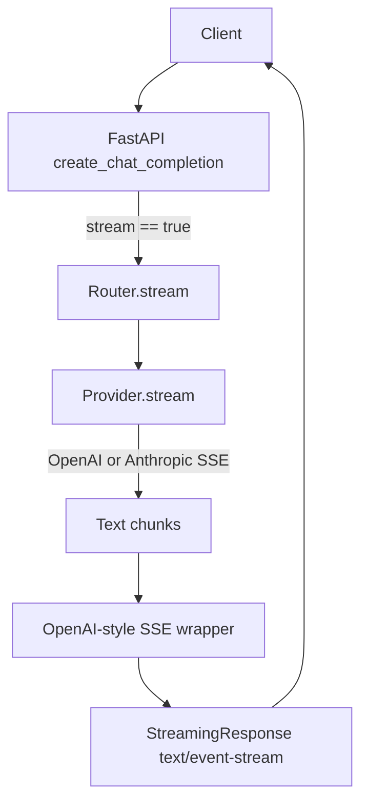

- 
  - 
    - Goals
      - **Task A**: Implement `AnthropicProvider.stream()` to consume Anthropic's SSE `/v1/messages` stream and yield raw text chunks.
      - **Task B**: Replace `fake_stream_response()` in the chat API with real provider streaming, normalizing both OpenAI and Anthropic into a single OpenAI-style SSE output using `StreamingResponse`.
      ### Context From Codebase
      - **Providers**
        - **Base class**: `[src/sentinel/providers/base.py](src/sentinel/providers/base.py)` defines `LLMProvider` with abstract `complete()` and `stream()`.
        - **OpenAI**: `[src/sentinel/providers/openai.py](src/sentinel/providers/openai.py)`
          - `OpenAIProvider.stream()` already implemented using `httpx.AsyncClient.stream("POST", ...)` against `/chat/completions` with `stream=True`.
          - It parses SSE `data:` lines, JSON-decodes, and yields `delta.content` text chunks.
          - `_do_completion()` handles non-streaming for OpenAI.
        - **Anthropic**: `[src/sentinel/providers/anthropic.py](src/sentinel/providers/anthropic.py)`
          - `_do_completion()` is implemented for non-streaming `/v1/messages` calls.
          - `stream()` currently raises `NotImplementedError` and will be our main implementation target.
      - **Routing & API**
        - **Router**: `[src/sentinel/providers/router.py](src/sentinel/providers/router.py)` has `Router.route()` which picks a provider and calls `provider.complete()` (non-streaming only).
        - **Chat API**: `[src/sentinel/api/v1/chat.py](src/sentinel/api/v1/chat.py)`
          - `create_chat_completion()` handles `/v1/chat/completions`.
          - For `request.stream == True`, it returns `StreamingResponse(fake_stream_response(), media_type="text/event-stream")` — a placeholder.
    - For non-streaming, it calls `router.route()` and returns the normal JSON structure.

### Task A: Implement `AnthropicProvider.stream()`

- **A.1 Understand Anthropic payload and headers**
- **A.1.1** Reuse header and body construction logic from `_do_completion()` in `AnthropicProvider` to ensure identical auth, model, and request fields.
- **A.1.2** Ensure the request body includes `"stream": True` as required by Anthropic's streaming API.
- **A.2 Implement HTTP streaming call**
- **A.2.1** Inside `AnthropicProvider.stream()`, use `async with self._client.stream("POST", "{self.base_url}/v1/messages", json=payload, headers=headers, timeout=...)` mirroring the OpenAI implementation pattern but using Anthropic's endpoint and body fields.
- **A.2.2** Access the response as an async iterator over lines (`async for line in response.aiter_lines()`), similar to `OpenAIProvider.stream()`.
- **A.3 Parse Anthropic SSE events**
- **A.3.1** Maintain a `current_event` variable initialized to `None`.
- **A.3.2** For each non-empty `line`:
  - If it starts with `"event:"`, strip the prefix and whitespace, and store the event name in `current_event`.
  - If it starts with `"data:"`, strip the prefix and whitespace to get the JSON payload string.
- **A.3.3** When a `data:` line is seen and `current_event` is set:
  - JSON-decode the data into `obj`.
  - If `current_event == "content_block_delta"` and `obj.get("delta", {}).get("type") == "text_delta"`, then:
    - Extract `text = obj["delta"].get("text", "")`.
    - If non-empty, `yield text` from `stream()`.
  - If `current_event == "message_stop"`, break out of the loop and end the generator.
- **A.3.4** Safely skip other event types (`message_start`, `content_block_start`, `content_block_stop`, etc.) since they don't contain user-visible text.
- **A.3.5** Add basic error handling:
  - Guard JSON parsing with `try/except` to ignore malformed lines without crashing the stream.
  - Optionally log or collect metrics through existing logging utilities if present.
- **A.4 Align with base class and typing**
- **A.4.1** Ensure `stream()` returns an async generator of `str` chunks, consistent with `LLMProvider.stream()` and `OpenAIProvider.stream()`.
- **A.4.2** Keep the method signature and docstring consistent with the base class and OpenAI implementation (e.g., parameter types, `async def stream(self, request: ChatCompletionRequest) -> AsyncIterator[str]:`).
- **A.5 Light testing and verification hooks**
- **A.5.1** (If tests exist) Add or update tests under the existing test suite (e.g., in `tests/providers/test_anthropic.py`) to:
  - Mock an Anthropic SSE response with `event:` / `data:` pairs including `content_block_delta` and `message_stop`.
  - Assert that `stream()` yields the expected concatenated text and stops on `message_stop`.
- **A.5.2** If no tests exist, add a small unit test file that uses a fake `httpx.AsyncClient` or an in-memory async iterator to simulate the streaming response.

### Task B: Wire streaming into `chat.py` with unified OpenAI-style SSE

- **B.1 Extend routing to support streaming**
- **B.1.1** In `[src/sentinel/providers/router.py](src/sentinel/providers/router.py)`, add a new async method, for example `async def stream(self, request: ChatCompletionRequest) -> AsyncIterator[str]:` that:
  - Selects the provider the same way `route()` does (including any failover logic, if appropriate, or a simpler first-provider-only approach depending on current design).
  - Calls `provider.stream(request)` and returns/forwards that async iterator.
- **B.1.2** Decide on behavior if a provider does not support streaming (e.g., raises `NotImplementedError`):
  - Propagate the error to the API layer, or
  - Fallback to non-streaming `complete()` and adapt its response into a single streamed chunk.
  - For today's scope, document that only OpenAI and Anthropic support streaming and raise a clear error for others.
- **B.2 Replace `fake_stream_response()` in `chat.py**`
- **B.2.1** In `[src/sentinel/api/v1/chat.py](src/sentinel/api/v1/chat.py)`, locate the streaming branch inside `create_chat_completion()` where it currently does `return StreamingResponse(fake_stream_response(), media_type="text/event-stream")`.
- **B.2.2** Implement a real async generator `async def stream_response() -> AsyncIterator[bytes]:` (nested inside the endpoint or as a separate function) that:
  - Calls `router.stream(request)` to obtain an async iterator of raw `str` chunks from the selected provider.
  - For each `chunk` from the provider:
    - Wrap it in an OpenAI-style SSE message:
      - Build a Python dict `payload = {"choices": [{"delta": {"content": chunk}}]}`.
      - Serialize with `json.dumps(payload)`.
      - Format as SSE: `f"data: {json_str}\n\n"`.
      - Yield it as `bytes` (`.encode("utf-8")`).
  - After the loop ends, yield the end signal: `b"data: [DONE]\n\n"`.
- **B.2.3** Replace the placeholder with `StreamingResponse(stream_response(), media_type="text/event-stream")` so the endpoint returns real streaming data.
- **B.3 Preserve request/response compatibility**
- **B.3.1** Keep the request schema as-is so that `stream=True` on the existing request model triggers the streaming branch without any client changes.
- **B.3.2** Ensure the streaming SSE messages match OpenAI's structure closely enough for existing or future OpenAI-compatible clients:
  - Per-chunk shape: `{ "choices": [{ "delta": { "content": "..." } }] }`.
  - End marker: `data: [DONE]\n\n`.
- **B.3.3** Confirm that non-streaming behavior is unchanged: for `stream=False` the endpoint should continue to use `router.route()` and return the existing JSON completion format.
- **B.4 Error handling and edge cases**
- **B.4.1** Decide what happens on provider-side errors mid-stream:
  - Catch exceptions around iteration of `router.stream(request)`.
  - Optionally send one final SSE message with an error-like payload, or just terminate the stream; for a first iteration, terminating the stream and logging is acceptable.
- **B.4.2** Make sure that cancellations (client disconnects) are tolerated: let `StreamingResponse` and FastAPI handle disconnect exceptions; optionally log them but don't crash the app.

### Optional: Mermaid overview of the streaming flow

### Todos

- **implement-anthropic-stream**: Implement `AnthropicProvider.stream()` to POST to `/v1/messages` with `stream: true`, parse SSE `event:`/`data:` lines, yield `delta.text` for `content_block_delta` with `text_delta`, and stop on `message_stop`.
- **add-router-stream-method**: Add `Router.stream()` in `router.py` to select a provider and forward `stream()` calls.
- **replace-fake-stream-in-chat**: Replace `fake_stream_response()` usage in `chat.py` with a real async generator that wraps provider chunks into OpenAI-style SSE messages and returns a `StreamingResponse`.
- **add-tests-for-streaming**: Add or update tests to cover Anthropic streaming parsing and the chat endpoint's SSE normalization behavior.
